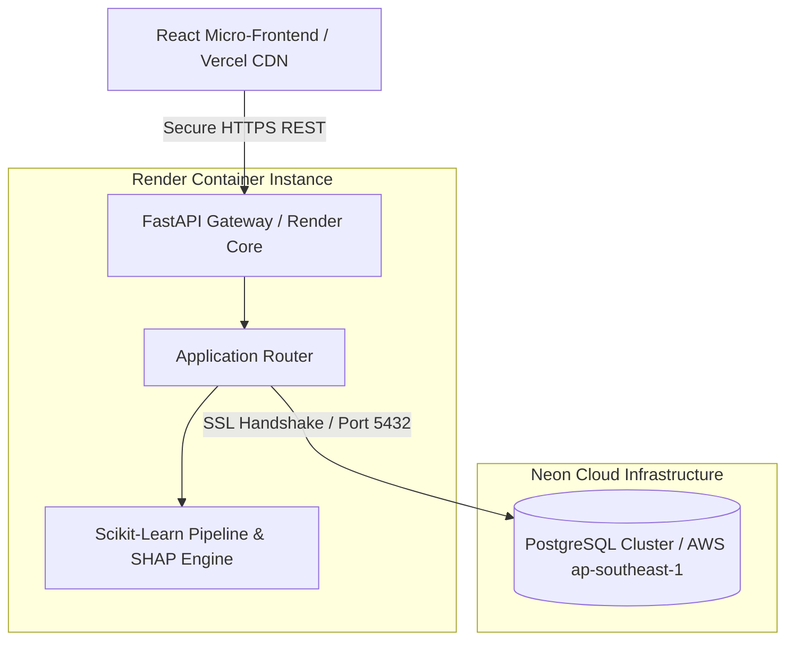

# 📊 ChurnInsight: Enterprise Customer Churn Analytics & XAI Pipeline

An end-to-end predictive analytics web application that forecasts customer churn risk using advanced Machine Learning frameworks and generates transparent model explanations using Explainable AI (XAI) diagnostics. 

The system operates on a cloud-decoupled architecture, utilizing a managed relational database cluster for high-throughput transactional queries and a React-based interactive micro-frontend.

🌐 **Live Application:** [(https://customer-churn-analysis-9zk8wdoaq-spurthi-019s-projects.vercel.app/)]  
🔌 **Production API Instance:** [(https://churninsight-backend.onrender.com)]

---

## 🚀 Key Engineering Features

* **Dynamic Predictive Engines:** Implements high-accuracy classification models (Random Forest / LightGBM) to evaluate real-time customer churn probabilities.
* **Explainable AI (XAI):** Integrated mathematical feature attribution matrices and macro-fleet impact charts to transparently illustrate *why* a customer is flagged as high-risk.
* **Decoupled Monorepo Architecture:** Clean architectural separation between the analytical Python FastAPI data layer and the responsive Vite/React user interface.
* **Production-Grade Data Infrastructure:** Connects seamlessly to a cloud-managed PostgreSQL database cluster hosted on Neon (Singapore region) utilizing secure SSL handshakes.
* **Robust Enterprise Security:** Implements dynamic environment variable injection (`python-dotenv`) to decouple database credentials from source code, avoiding public credential exposure.

---

## 📸 Core System Dashboard

### 🔍 Real-Time Risk Analysis & Diagnostic Panel
> *Analyze individual accounts, query customer database histories sequentially, and evaluate XAI attribution metrics instantly.*


### 📊 Macro Fleet Risk Metrics & Distribution
> *Visualize historical customer retention trends, monthly billing vs. churn correlations, and predictive distribution curves.*


---

## 🏗️ Architecture

The system operates on a clean, distributed monorepo architecture engineered for transactional integrity and horizontal scaling.

* **Frontend Layer:** A single-page application built using React and compiled via Vite. It acts as a client-side layout that consumes API endpoints and renders rich dashboard diagnostics dynamically.
* **Backend Application Layer:** Built with FastAPI and powered by an asynchronous ASGI production gateway (Uvicorn). This layer hosts ML model inference endpoints, database routing routines, and computation tasks.
* **Database Layer:** A production PostgreSQL cluster hosted on Neon's serverless infrastructure in the AWS Singapore region, handling relational client data with specialized query layers.
* **Authentication & Security:** Cryptographically secure connection handshakes coupled with strict separation between public frontends and internal database connection blocks.
* **APIs:** Asynchronous REST API contracts that serialize Python backend structures directly into client-side JSON components.
* **Deployment Architecture:** Independent pipeline splitting. Static client assets are delivered via Vercel’s global CDN network, while the computational backend runs on Render container clusters.

### System Architecture Diagram



---

## 🛠️ Tech Stack

### Frontend

| Technology | Function |
| --- | --- |
| **React.js** | Single-page layout construction component engine |
| **Tailwind CSS** | Low-level utility styling system and dark neon layout configuration |
| **Vite** | Fast frontend build utility and asset bundler |
| **Lucide Icons** | Professional typography iconography package |

### Backend

| Technology | Function |
| --- | --- |
| **FastAPI** | Asynchronous high-performance Python backend web framework |
| **Uvicorn** | High-performance ASGI production server implementation |
| **Scikit-Learn** | Core machine learning pipeline building and predictive model parsing |
| **SHAP Engine** | Explainable AI calculations and mathematical attribution math |
| **Python-Dotenv** | Inline application parameter parsing and runtime layer decoupling |

### Database

| Technology | Function |
| --- | --- |
| **PostgreSQL** | Primary high-throughput transactional relational database management engine |
| **Neon Cloud** | Serverless AWS-hosted data engine with automatic point-in-time branch cloning |
| **Psycopg2-Binary** | Optimized database driver interface built for raw Python compilation execution |

### Infrastructure & Dev Tools

| Technology | Function |
| --- | --- |
| **Vercel** | Automated static optimization pipeline delivery framework |
| **Render** | Managed container engine framework hosting active production APIs |
| **Git/GitHub** | Modern decentralized version control and branch synchronization system |
| **VS Code** | Local environment IDE workspace environment tool |

---

## 📂 Project Structure

```text
CUSTOMER_CHURN_ANALYSIS/
├── backend/
│   ├── database/
│   │   └── __init__.py
│   ├── __pycache__/
│   ├── .env
│   ├── app.py
│   ├── force_risk_mix.py
│   └── seed_more.py
├── data/
├── frontend/
│   ├── node_modules/
│   ├── src/
│   ├── index.html
│   └── package.json
├── ml_pipeline/
├── models/
├── tests/
│   ├── __pycache__/
│   └── test_pipeline.py
├── .gitignore
├── architecture_plan.md
├── Dockerfile
├── package-lock.json
└── requirements.txt

```

---

## ⚡ Getting Started

### Prerequisites

* Python 3.12+ installed locally.
* Node.js v18+ and npm installed locally.
* An active Neon PostgreSQL database instance.

### Installation

1. Clone the repository down to your machine:
```bash

```


git clone https://github.com/Spurthi-019/customer_churn_analysis.git
cd customer_churn_analysis

```

2.  Set up the Backend requirements package framework:
    ```bash
# Create and activate a clean virtual environment
python -m venv .venv
source .venv/bin/activate  # On Windows use: .venv\Scripts\activate

# Install structural dependencies directly from root
pip install -r requirements.txt

```

3. Set up Frontend client packages:
```bash

```


cd frontend
npm install
cd ..

```

### Environment Variables
Configure your secrets before initializing application processes. Create a `.env` file inside the `backend/` folder matching the sample layout below:

```text
DB_NAME=neondb
DB_USER=neondb_owner
DB_PASSWORD=your_secure_database_password_string
DB_HOST=ep-falling-band-aovfp5yl.c-2.ap-southeast-1.aws.neon.tech
DB_PORT=5432

```

### Run Locally

* **Initialize the Backend Service Node:**
```bash

```


cd backend
uvicorn app:app --host 127.0.0.1 --port 8000 --reload

```
*   **Initialize the Frontend Client Workspace:**
    ```bash
cd frontend
npm run dev

```

### Production Build

To assemble static deployment assets directly before cloud distribution pipelines, invoke the compilation task inside the frontend root:

```bash
cd frontend
npm run build

```

---

## 🔐 Environment Variables

| Variable | Description | Required | Default |
| --- | --- | --- | --- |
| `DB_NAME` | Name of the active cloud transactional database cluster | **Yes** | `neondb` |
| `DB_USER` | Connection username for accessing the Postgres administrative roles | **Yes** | `neondb_owner` |
| `DB_PASSWORD` | Cryptographically unique password token for cluster verification | **Yes** | *None* |
| `DB_HOST` | DNS target route leading directly to the cloud cluster engine | **Yes** | *None* |
| `DB_PORT` | Port configuration value mapping database traffic vectors | **Yes** | `5432` |
| `VITE_API_URL` | Cloud root link used by frontend components to route API calls | **Yes** | `[http://127.0.0.1:8000](http://127.0.0.1:8000)` |

---

## 🔄 Workflow

```text
[User Actions] ──► Select Account ID ──► Request Prediction
                                             │
                                             ▼
[Data Pipeline] ──► Fetch Profile Details ◄── Neon PostgreSQL
                         │
                         ▼
[ML Processor] ──► Execute Scikit-Learn Model ──► Parse Probability
                                                      │
                                                      ▼
[XAI Engine] ────► Generate SHAP Matrix Values ──► Build Attributions
                                                      │
                                                      ▼
[Client UI] ─────► Render Macro Fleet Metrics ◄── JSON Package Return

```

* **User Flow:** Administrators view a dark-neon workspace layout, entering client profile numbers or selecting high-level summary rows directly from interactive data grids.
* **System Flow:** FastAPI listens for incoming browser fetch methods, instantly converting parameter strings into targeted SQL execution parameters.
* **Data Flow:** Clean tables travel from Neon's Singapore cloud cluster down to the local Scikit-Learn model binary matrix, appending attribution weights to payload items before completing the request cycle.

---

## 🌐 Deployment

### Deployment Strategy

The codebase operates on a fully container-decoupled deployment architecture to achieve highly efficient performance characteristics at zero cost:

* **Backend Hosting Platform:** Render (Web Services Environment).
* **Frontend Hosting Platform:** Vercel (Edge Network Platform).

### Environment Setup & Build Settings

* **Render (API Gateway Node):**
* **Root Directory:** *Keep completely blank / repository root reference.*
* **Build Command:** `pip install -r requirements.txt`
* **Start Command:** `uvicorn backend.app:app --host 0.0.0.0 --port $PORT`


* **Vercel (Client UI Application):**
* **Framework Preset:** `Vite`
* **Root Directory:** `frontend`
* **Environment Variable Key:** `VITE_API_URL` ──► Value: `[https://churninsight-backend.onrender.com](https://churninsight-backend.onrender.com)`


### Deployment Verification Checklist

* [x] Connection credentials bound into Render Environment panels cleanly.
* [x] Repository dependency requirements moved successfully into root folder context.
* [x] Web client set to production asset generation parameters without development paths.
* [x] Verification testing checking active SSL status strings across communication blocks.

---

## 📈 Performance Optimizations

* **Monorepo Separation Integration:** Moving the global `requirements.txt` target list directly to root contexts eliminates internal Render cache indexing delays.
* **Implicit Port Allocation Routing:** Cleaning manual integer definitions out of the cloud start string lets Render automatically control application communication vectors without creation conflicts.
* **Vercel Static Code Chunking:** Built using production Vite compiler pipelines to split heavy asset maps into cached browser chunks.

---

## 🔒 Security

* **Credential Decoupling Protocols:** Strict zero-exposure policy. Database passwords are never committed to Git source control.
* **Database Isolation Controls:** Real-time database traffic requires encrypted SSL handshakes validated directly by the cloud Neon database cluster manager.
* **Explicit Environment Configuration:** Cross-origin request layers utilize clean address checks to block unknown third-party execution contexts.

---

## 🧪 Testing

The codebase includes targeted automated verification validation checks inside the isolated test suite layout.

Execute the following testing routine command directly using your terminal framework:

```bash
pytest tests/test_pipeline.py

```

The test package automatically verifies file serialization consistency, feature structure alignments, and core model calculation loops.

---

## 📊 Monitoring & Observability

* **Uvicorn Event Monitors:** Render console tails log traffic status outputs, tracing transaction latency values dynamically.
* **Application Startup Complete Trackers:** Explicit process diagnostics display engine framework and dependencies state configurations right before listening states begin.
* **Error Class Verification Outputs:** Detailed stack tracing handles `ModuleNotFoundError` variations or database validation alerts natively without causing application crashes.

---

## 🤝 Contributing

Contributions are what make the open-source community such an amazing place to learn, inspire, and create. Any contributions you make are greatly appreciated.

1. Fork the Project Repository.
2. Create your Feature Branch (`git checkout -b feature/AmazingFeature`).
3. Commit your Changes using descriptive messages (`git commit -m 'feat: add amazing new feature module'`).
4. Push to the Branch (`git push origin feature/AmazingFeature`).
5. Open a professional, structured Pull Request.

---

## 🗺️ Roadmap

* [x] Establish high-speed PostgreSQL connectivity endpoints using Neon framework layers.
* [x] Build decoupled FastAPI routers to optimize mathematical model calculation queries.
* [x] Resolve monorepo build route issues and complete production cloud deployments.
* [ ] Incorporate comprehensive testing scripts covering wide array verification limits.
* [ ] Implement automated retention communication message sequences via intelligent workflows.

---

## ❓ FAQ

**Q: Why separate the application across Render and Vercel?**

A: Vercel is highly optimized for static single-page web experiences, delivering React pages almost instantly via global edge servers. Render specializes in processing ongoing backend computations, making it the perfect choice for heavy machine learning workflows.

**Q: How does the application read variable configurations without local `.env` files active?**

A: During cloud deployment initialization steps, Render dynamically injects hidden configuration values directly into the active container system memory environment. The application then parses these values using the `python-dotenv` engine.

---

## 📄 License

Distributed under the MIT License. See the internal repository file data definitions for comprehensive validation conditions.

---

## 👨‍💻 Author

**Spurthi-019**

* GitHub: [@Spurthi-019](https://www.google.com/search?q=https://github.com/Spurthi-019)
* Project Repository: [customer_churn_analysis](https://www.google.com/search?q=https://github.com/Spurthi-019/customer_churn_analysis)

---

## 🙏 Acknowledgements

* [FastAPI Team](https://www.google.com/search?q=https://fastapi.tiangolo.com/) for the incredibly fast, type-safe development framework.
* [Neon PostgreSQL Core Creators](https://www.google.com/search?q=https://neon.tech/) for delivering serverless database performance.
* [Vercel & Render DevOps Engineering Staff](https://www.google.com/search?q=https://render.com/) for building reliable cloud hosting infrastructure.

---

## ⭐ Support

If you found this project helpful, please consider taking these quick actions to support its development:

* Give the project a **Star** ⭐ at the top right of this repository page.
* Open an **Issue** 🐛 if you uncover unexpected errors or package processing blocks.
* Submit a **Pull Request** 🚀 to suggest code performance enhancements or layout additions.
